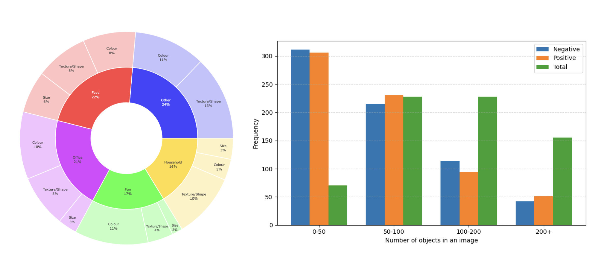

# PairTally: A Benchmark Dataset

<p align="center">
  
</p>

<p align="center">
  <strong>Can Current AI Models Count What We Mean, Not What They See?</strong><br>
  <em>Gia Khanh Nguyen<sup>1</sup>, Yifeng Huang<sup>2</sup>, Minh Hoai<sup>1</sup></em><br>
  <sup>1</sup>Australian Institute for Machine Learning, University of Adelaide<br>
  <sup>2</sup>Stony Brook University
</p>

<p align="center">
  <a href="#citation">Paper</a> •
  <a href="#installation">Installation</a> •
  <a href="#dataset">Dataset</a> •
  <a href="#evaluation">Evaluation</a> •
  <a href="#results">Results</a> •
  <a href="#citation">Citation</a>
</p>

---
## Key Contributions

- **First Fine-Grained Counting Benchmark**: Introduces the first dataset specifically designed to test subtle within-class distinctions, with 681 high-resolution, controlled pairs.
- **Comprehensive Evaluation**: Assessment of 10 state-of-the-art models across three counting paradigms
- **Diagnostic Analysis**: Reveals critical limitations in current vision models for intent-driven counting
- **Real-world Relevance**: Addresses scenarios where accurate counting depends on subtle visual distinctions

## Dataset

### Statistics

| Property | Value |
|----------|-------|
| Total Images | 681 |
| Object Categories | 54 |
| Subcategories | 98 |
| Supercategories | 5 (Food, Fun, Household, Office, Other) |
| Inter-category pairs | 50 |
| Intra-category pairs | 47 |

<p align="center">
  
</p>

### Structure

```
PairTally/
├── images/                    # 681 high-resolution images
├── annotations/
│   ├── pairtally_annotations_simple.json
│   ├── pairtally_annotations_inter_simple.json
│   ├── pairtally_annotations_intra_simple.json
│   └── image_metadata.json
└── evaluation/                # Evaluation scripts and tools
```

### Attribute Distribution

| Attribute Type | Percentage | Examples |
|---------------|------------|----------|
| Color | 43.5% | Black vs. white checker pieces |
| Shape/Texture | 42.5% | Spiral vs. penne pasta |
| Size | 14.1% | Large vs. small marbles |

## Quick Start with Demo Notebook

**Get started in minutes!** Explore the dataset and run evaluations through our interactive Jupyter notebook.

### 1. Basic Setup
```bash
# Clone repository
git clone https://github.com/bbvisual/PairTally_Benchmark.git
cd PairTally_Benchmark

# Create environment
conda create -n pairtally python=3.8
conda activate pairtally

# Install basic requirements
pip install jupyter numpy pandas matplotlib pillow tqdm
```

### 2. Download Dataset
```bash
# Download images from Google Drive
# Link: https://drive.google.com/file/d/1TnenXS4yFicjo81NnmClfzgc8ltmmeBv/view
# Extract PairTally-Images-Only.zip

# Move images to correct location
unzip PairTally-Images-Only.zip
mv PairTally-Images-Only/* dataset/pairtally_dataset/images/

# Verify setup
cd dataset
python verify_dataset.py
```

### 3. Launch Interactive Notebook
```bash
# Start Jupyter notebook
jupyter notebook PairTally_Demo_Notebook.ipynb
```

**The notebook provides:**
- Dataset visualization and statistics
- Sample annotations and bounding boxes  
- Model evaluation pipeline
- Performance analysis tools
- Result generation and plotting

## Alternative: Python API

```python
import json
from PIL import Image
import matplotlib.pyplot as plt

# Load annotations
with open('dataset/pairtally_dataset/annotations/pairtally_annotations_simple.json', 'r') as f:
    annotations = json.load(f)

# Load and visualize sample
image_name = list(annotations.keys())[0]
annotation = annotations[image_name]

print(f"Positive class: {annotation['positive_prompt']}")
print(f"Negative class: {annotation['negative_prompt']}")
print(f"Positive count: {len(annotation['points'])}")
print(f"Negative count: {len(annotation['negative_points'])}")
```

## Model Evaluation Code

The evaluation scripts for all models from the paper are available in the `models/` directory. Each model has its own subfolder with setup instructions and evaluation scripts:

```
models/
├── countgd/         # CountGD - Multi-Modal Open-World Counting
├── dave/            # DAVE - Detect-and-Verify Paradigm  
├── geco/            # GeCo - Unified Architecture for Low-Shot Counting
├── loca/            # LoCA - Learning to Count Everything
├── learningtocount/ # FamNet - Learning to Count Everything  
└── vlms/            # Vision-Language Models (Qwen2.5-VL, LLaMA-3.2, InternVL3, Ovis2)
```

**Quick Setup:**
1. Navigate to the model directory: `cd models/<model_name>/`
2. Follow the setup instructions in the model's README.md
3. Run the evaluation scripts provided

**Example:**
```bash
# Evaluate CountGD
cd models/countgd/
# Follow models/countgd/README.md for setup
python evaluate_DICTA25_combined.py

# Evaluate Vision-Language Models
cd models/vlms/  
# Follow models/vlms/README.md for setup
python evaluate_pairtally_qwen2_5vl_count_both_classes.py
```

For detailed setup instructions, model-specific requirements, and evaluation parameters, see the README files in each model directory.

## Evaluate Your Own Model

Want to evaluate your own counting model on PairTally? We provide a complete template and example script:

### Quick Start Template
1. **Copy the evaluation template**: `evaluate_custom_model_template.py`
2. **Follow the setup guide**: `CUSTOM_MODEL_EVALUATION_TEMPLATE.md`
3. **Implement your model interface**:

```python
class YourCountingModel:
    def predict(self, image, exemplars, prompt=None):
        # Your model inference code
        return predicted_count
```

### Example Implementation (GeCo-style)
```python
def predict(self, image, exemplars, prompt=None):
    # Preprocess image and exemplars
    image_tensor = self.transform(image).unsqueeze(0).to(self.device)
    exemplar_boxes = torch.tensor(exemplars).float().to(self.device)
    
    with torch.no_grad():
        outputs = self.model(image_tensor, exemplar_boxes)
        count = outputs['count'].item()
    
    return int(round(count))
```

### Run Evaluation
```bash
# 1. Modify the template for your model
cp evaluate_custom_model_template.py evaluate_my_model.py
# Edit evaluate_my_model.py to implement your model

# 2. Update paths and run
python evaluate_my_model.py
```

**Template includes:**
- Standard evaluation metrics (MAE, RMSE, NAE)
- Proper data loading and preprocessing
- Results saving and analysis
- Error handling and debugging tips

See `CUSTOM_MODEL_EVALUATION_TEMPLATE.md` for detailed instructions and examples.

## Results

### Overall Performance (All Objects Counting)

| Model | Type | MAE ↓ | RMSE ↓ |
|-------|------|-------|--------|
| Mean Baseline | - | 98.56 | 151.45 |
| Median Baseline | - | 89.12 | 159.01 |
| **GeCo** | Exemplar | **53.07** | **98.00** |
| CountGD | Text+Exemplar | 57.33 | 108.93 |
| CountGD (Text) | Text-only | 160.46 | 220.64 |
| LoCA | Exemplar | 62.78 | 136.76 |
| DAVE | Exemplar | 69.49 | 130.42 |
| FamNet | Exemplar | 88.30 | 148.42 |
| LLaMA-3.2 | VLM | 97.56 | 175.80 |
| Qwen2.5-VL | VLM | 99.88 | 174.93 |
| LLMDet | Text-only | 107.84 | 177.66 |
| Ovis2 | VLM | 111.56 | 174.16 |
| InternVL3 | VLM | 115.98 | 179.89 |

### Performance with Distractors (Inter vs Intra)

| Model | Inter MAE ↓ | Intra MAE ↓ | Inter NAE ↓ | Intra NAE ↓ | Inter CI ↑ | Intra CI ↑ |
|-------|-------------|-------------|-------------|-------------|------------|------------|
| Mean Baseline | 39.42 | 66.71 | 0.714 | 0.535 | 0.969 | 0.977 |
| Median Baseline | 37.38 | 57.25 | 1.587 | 0.776 | 0.970 | 0.987 |
| CountGD | 39.78 | 56.54 | 0.673 | 0.906 | 0.934 | 0.977 |
| GeCo | 45.05 | 54.80 | 0.777 | 0.935 | 0.985 | 0.986 |
| DAVE | 46.27 | 46.75 | 0.779 | 0.797 | 0.982 | 0.980 |
| Qwen2.5-VL | 46.35 | 67.86 | 0.598 | 0.712 | 0.927 | 0.983 |
| LLaMA-3.2 | 49.14 | 58.73 | 0.730 | 0.740 | 0.949 | 0.992 |
| CountGD (Text) | 50.23 | 53.93 | 0.712 | 0.841 | 0.914 | 0.971 |
| Ovis2 | 56.87 | 74.24 | 0.711 | 0.736 | 0.981 | 0.974 |
| InternVL3 | 55.89 | 71.47 | 0.667 | 0.721 | 0.987 | 0.999 |
| LoCA | 71.89 | 57.45 | 1.177 | 0.950 | 0.806 | 0.999 |
| FamNet | 66.97 | 74.75 | 1.363 | 1.440 | 0.893 | 0.959 |
| LLMDet | 78.72 | 142.08 | 0.661 | 1.060 | 0.985 | 0.990 |

### Attribute-Specific Performance (Intra-category)

| Model | Color MAE ↓ | Color RMSE ↓ | Color NAE ↓ | Size MAE ↓ | Size RMSE ↓ | Size NAE ↓ | Texture MAE ↓ | Texture RMSE ↓ | Texture NAE ↓ |
|-------|-------------|--------------|-------------|------------|-------------|-------------|---------------|----------------|---------------|
| Mean Baseline | 55.16 | 83.51 | 1.698 | 25.81 | 36.14 | 1.154 | 43.75 | 59.38 | 0.838 |
| Median Baseline | 49.37 | 88.01 | 0.967 | 24.71 | 36.75 | 0.586 | 40.89 | 61.71 | 0.720 |
| **DAVE** | 63.44 | 89.16 | **0.738** | 33.26 | 39.31 | 1.293 | 34.14 | 43.00 | **0.693** |
| CountGD (Text) | 64.51 | 98.99 | 0.760 | 38.95 | 45.61 | 1.410 | 48.06 | 73.20 | **0.735** |
| CountGD | 75.40 | 117.32 | 0.856 | 36.30 | 42.35 | 1.402 | 43.95 | 57.42 | 0.793 |
| GeCo | 63.40 | 88.77 | 0.791 | 35.06 | 41.13 | 1.345 | 52.53 | 74.55 | 0.946 |
| LoCA | 65.37 | 95.24 | 0.799 | 33.34 | 39.66 | **1.244** | 57.33 | 91.11 | 1.007 |
| FamNet | 84.92 | 117.33 | 1.296 | 56.32 | 75.44 | 1.859 | 70.45 | 90.64 | 1.448 |
| LLMDet | 118.29 | 151.01 | 2.12 | 68.68 | 82.73 | 4.18 | 89.33 | 116.06 | 2.04 |

### Key Findings

1. **Model Limitations**: Even best-performing models achieve MAE > 50, indicating substantial room for improvement
2. **Distractor Sensitivity**: Most models struggle more with intra-category pairs than inter-category discrimination  
3. **Attribute Hierarchy**: Color differences are most distinguishable, size differences most challenging
4. **VLM Performance**: Large vision-language models underperform specialized counting methods
5. **Overcounting Bias**: Models frequently count all objects rather than following specific prompts

## Citation

```bibtex
@inproceedings{nguyen2025pairtally,
  title={Can Current AI Models Count What We Mean, Not What They See? 
         A Benchmark and Systematic Evaluation},
  author={Nguyen, Gia Khanh and Huang, Yifeng and Hoai, Minh},
  booktitle={Digital Image Computing: Techniques and Applications (DICTA)},
  year={2025}
}
```

## License

This dataset is released under the [CC BY-NC 4.0](https://creativecommons.org/licenses/by-nc/4.0/) license for academic research purposes.

## Contact

**Gia Khanh Nguyen**  
Australian Institute for Machine Learning  
University of Adelaide  
Email: giakhanh.nguyen@adelaide.edu.au

## Acknowledgments

We thank the Australian Institute for Machine Learning and Stony Brook University for supporting this research. Special thanks to all contributors who helped with data collection and annotation.

---

<p align="center">
  <a href="https://github.com/bbvisual/PairTally_Benchmark">GitHub</a> •
  <a href="#citation">Paper</a> •
  <a href="https://drive.google.com/file/d/1TnenXS4yFicjo81NnmClfzgc8ltmmeBv/view">Dataset</a>
</p>
